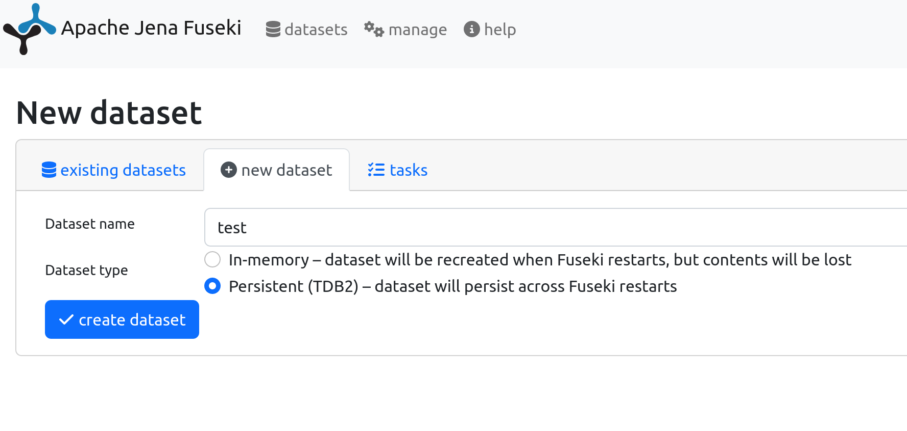
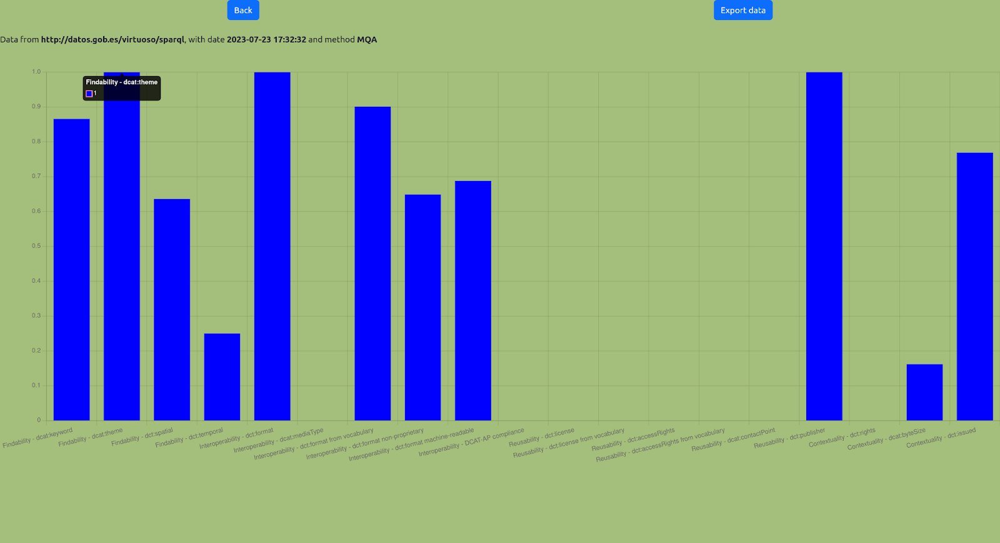
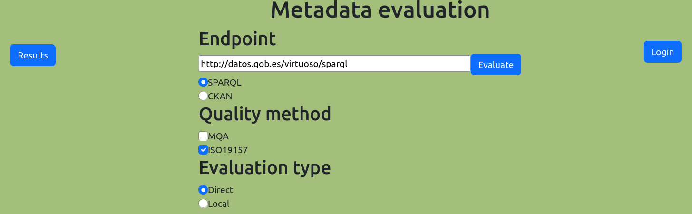
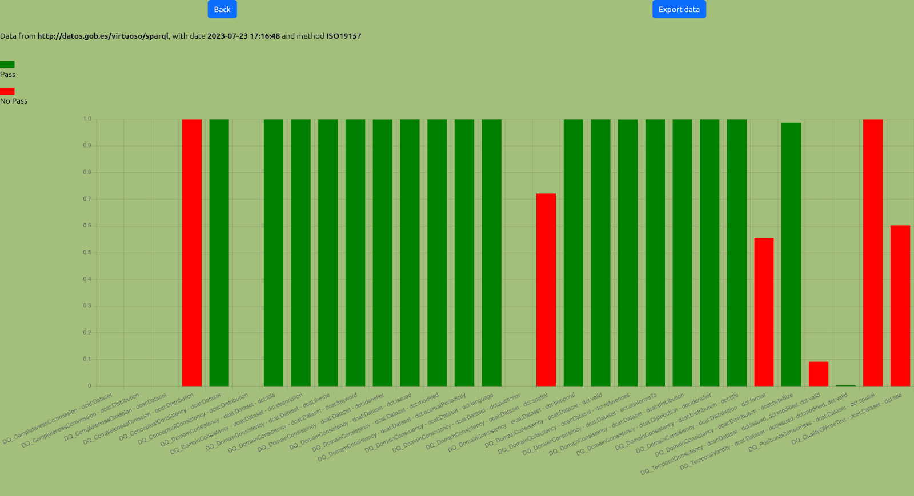
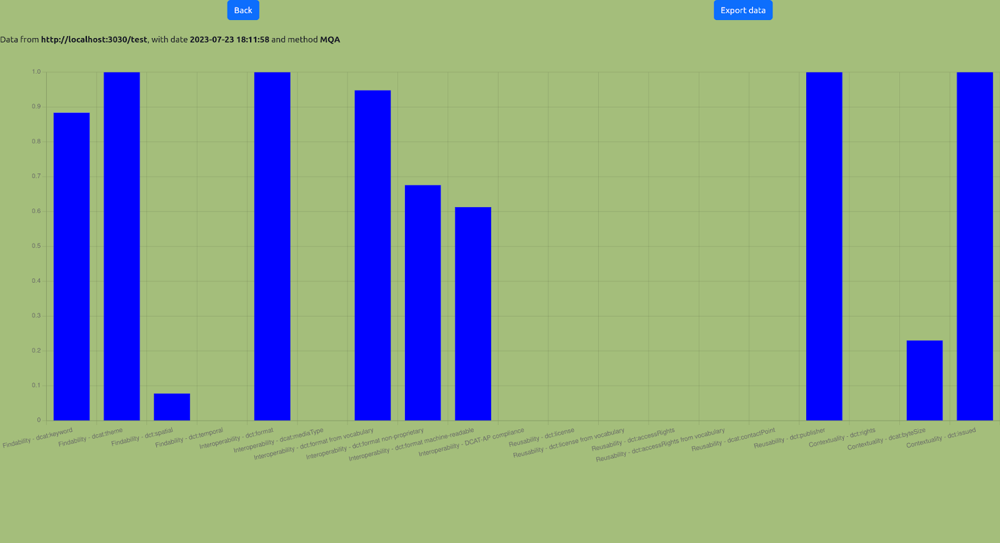
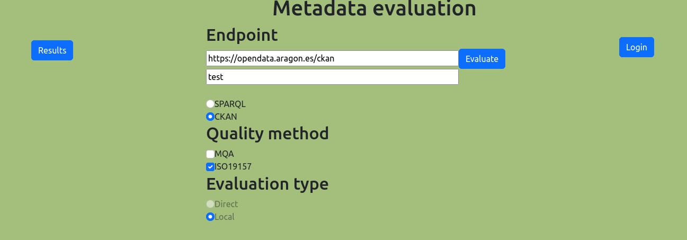
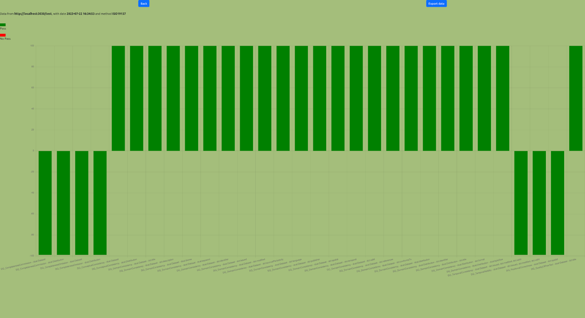

# Metadata-Monitoring: Web portal for the monitoring of metadata quality in Government Open Data portals.

## Table of Contents <!-- omit in toc -->

- [Introduction](#introduction)
- [Installation](#installation)
- [User manual](#user manual)
- [Credits](#credits)

## Introduction
The objective of this Open Sorce project is to provide a software for the deployment of a web portal for monitoring the metadata quality of open data portals based on existing methods of metadata quality.

To promote transparency and citizen participation, many governments, both at the national and local levels, have
have promoted the creation of open data initiatives to disseminate the data they work with. These initiatives are implemented through the launch of open data portals. The main element of these portals are interoperable online catalogs that facilitate the search and publication of open datasets based on the metadata describing them.
In order to promote interoperability and to make open data easily findable, a common vocabulary should be used to define these metadata and and its content must be of high quality. Regarding the vocabulary, there is a general consensus on the use of DCAT, an RDF-based metadata schema proposed by W3C for the description of data catalogs. With regard to the evaluation of metadata quality, there are several emerging proposals, among them the [MQA (Metadata Quality Assurance) methodology](https://data.europa.eu/mqa/methodology), developed by the European Commission for the European Data Portal, and [the methodology that adapts the ISO 19157 standard for geographic information quality to the context of metadata of open data portals](https://doi.org/10.1109/ACCESS.2021.3073455).

This web portal provides a user interface that facilitates and improves the user experience when applying these quality assessment methods (MQA and ISO19157), adding additional features that may be useful such as automatic monitoring of an open data portal, graphical presentation of the evaluation results, and the export of these results with the DQV vocabulary (Data Quality Vocabulary), a vocabulary based on RDF that is currently used to report on quality. 

For the development of the web application that supports the monitoring portal, the MEAN technology stack has been used: Angular for the Frontend, Node.js and Express for the Backend, and MongoDB for the storage of the evaluation results. As for the automatic calculation of the quality assessment measures, this has been developed in Python and the SPARQL language has been integrated to make queries on the content of the metadata of the evaluated open data portal.

## Installation
This Open Source project has the following sotware requirements:
- Node.js v16.x
- Python3
- MongoDB 6.0
- Fuseki

The following subsections describe the deployment of the software on a host using Ubuntu 22.04 as operating system. This installation steps could be adapted to other operating system environments.
### 1. Installation of Node.js v16
We need to install specifically version 16, as this is required for the client implemented with Angular.
First, we need to install curl if not previously installed:
```
sudo apt-get install curl
```
Then, we download the specfic version of node.js and we install it:
```
curl -sL https://deb.nodesource.com/setup_16.x | sudo -E bash -
sudo apt-get install -y nodejs
```
The version installed should be v16. In can be checked with the following command:
```
node-v
```
### 2. Installation of dependencies in the backend and front end
First, we need to clone the software at 'master' brand. 
After this, we must install depedencies at the backend from a terminal
```
cd backend
npm install
```
Probably, npm nodemon is also required:
```
npm install nodemon --save-dev
```
Then, we need to install the dependecies at the frontend:
```
cd frontend
npm install
```
### 3. Installation and launch of MongoDB service
For the installation of the MongoDB database, we can follow the instructions from https://www.mongodb.com/docs/manual/tutorial/install-mongodb-on-ubuntu/

```
sudo apt-get install gnupg curl

curl -fsSL https://pgp.mongodb.com/server-6.0.asc | \
   sudo gpg -o /usr/share/keyrings/mongodb-server-6.0.gpg \
   --dearmor

echo "deb [ arch=amd64,arm64 signed-by=/usr/share/keyrings/mongodb-server-6.0.gpg ] https://repo.mongodb.org/apt/ubuntu jammy/mongodb-org/6.0 multiverse" | sudo tee /etc/apt/sources.list.d/mongodb-org-6.0.list

sudo apt-get update

sudo apt-get install -y mongodb-org
```
The MongoDB service can be started on a terminal with the following command: 
```
service mongod start
```
The service should be started at this connection URL: mongodb://localhost:27017
If necessary, the service can be stopped with the following command:
```
service mongod stop
```
### 4. Creation of the MongoDB database
The MongoDB database can be administered with Studio 3T application.
The instllation of this application is explained at https://studio3t.com/knowledge-base/articles/how-to-install-studio-3t-on-linux/ . After donwloading the installation compressed, file, we need to unzip:
```
tar -xvzf studio-3t-linux-x64.tar.gz
```
and execute the installation:
```
sh studio-3t-linux-x64.sh
```
Then, we start Studio 3T and we establish a connection with the MongoDB service (localhost, port: 27017). After having established the connection, we need to create two databases: 'results' and 'agenda'.
Within 'results' database, we need to create the collection 'admins' with the information of two users. These two users can be created executing the following instructions through Studio 3T:
```
db.admins.insert({ username: "user", password: "user" })
db.admins.insert({ username: “admin”, password: “admin” })
```
If we want an enhanced security for the  login of users, we can modify 'scquema.js' (admin_schema) to use comparisons with encrypting function.

### 5. Start the backend and frontend
If we are using an IDE for the development like Webstorm, we can start directly the backend and frontend from this IDE. Otherwise, we can start them from a terminal with 'npm'. In the case of the backend, we would execute the following:
```
cd backend
npm start
```
In the case of the frontend, it would be similar:
```
cd frontend
npm start
```
Then, the frontend should be accessible from a browser at http://localhost:4200/

The execution of backend and frontend can be stopped with Ctrl+C.

### 6. Intallation and launch of Fuseki
If the evaluation of an Open Data portal is performed locally with a copy of the metadata contents, we need a triple-store to save temporally the metadata and query it with SPARQL. For the deployment of this triple-store we have decided to use a Docker container with Fuseki technology. The installation and execution of the container just requires the execution of the following command:
```
docker run -d -p 3030:3030 -e ADMIN_PASSWORD=pass123 stain/jena-fuseki
```
This will download the neccessary software (if not performed previously) and will start the Fuseki web portal at  http://localhost:3030. 

The first time we access the portal at https://localhost:3030 , we need to login as 'admin' with password 'pass123'. In case of not specifying a password with the docker command, this password is auto-generated. In case of autogeneration, we need to check the logs (using 'docker logs') or directly the output if the -d option was not used.

More information at: https://hub.docker.com/r/stain/jena-fuseki/

Last, we need to add a new dataset, which will be used for the temporal storage of metadata. This can be done through the 'management: New dataset' option. For instance, we call this dataset 'test' and use 'Persistent (TDB2) – dataset will persist across Fuseki restarts' as Dataset type.



### 7. Configuration of the python environment
We need to set up a python virtual environment for the execution of the python environment.

First, we need to install the venv module of python, if not installed previously:
```
sudo apt install python3.10-venv
```
Then, we need to create a virtual environment. For instance, we call it 'my-environment':
```
cd backend/pythonPrograms
python3 -m venv my-environment
source my-environment/bin/activate
```
Then, we install the required libraries listed in backend/pythonPrograms/requirements.txt (this requirement.txt file is generated in an existing environment with the command 'pip freeze > requirements.txt'):
```
pip install -r requirements.txt
```
If this doesn't work may be due to the version of the setuptools. If so, you can solve this problem with the following command:
```
pip install "setuptools<58.0.0"
```
At this point, we are able to indicate the backend the location of our virtual environment at 'backend/app_server/controllers/evaluateController.js' file. By default, myPython const contains the value:
```
./app_server/pythonPrograms/my-environment/bin/python3
```
It can be modified if the virtual environment was created at a different location.

Last, it must be noted that the first lines of the main() function of the python progrms modify the working direcory to the location of the current file and let the relative paths work:
```
# Change the working directory to the file location
abspath = os.path.abspath(__file__)
dname = os.path.dirname(abspath)
os.chdir(dname)
```
## User manual
If the installation of the software worked properly, the web application (frontend) is available at https://localhost:4200/evaluation.

Some examples of successful execution are the following:
- Endpoint: http://datos.gob.es/virtuoso/sparql (SPARQL), Quality method: MQA, Evaluation type: direct

after clicking on the results, the application should display something similar to the following screenshot


- Endpoint: http://datos.gob.es/virtuoso/sparql (SPARQL), Quality method: ISO19157, Evaluation type: direct

after clicking on the results, the application should display something similar to the following screenshot


- Endpoint: http://datos.gob.es/virtuoso/sparql (SPARQL), Quality method: MQA, Evaluation type: Local (Note: there is a limitation of a maximum number of 500 records for the harvesting, it can be modified at SPARQ_harvester.py)

after clicking on the results, the application should display something similar to the following screenshot


- Endpoint: https://opendata.aragon.es/ckan (CKAN), Quality method: ISO19157, Evaluation type: Local (Note: there is a limitation of a maximum number of 500 records for the harvesting, it can be modified at CKAN_harvester.py)

after clicking on the results, the application should display something similar to the following screenshot


- Endpoint: https://opendata.aragon.es/sparql (SPARQL), Quality method: MQA, Evaluation type: Direct

- Endpoint: https://data.europa.eu/sparql (SPARQL), Quality method: MQA, Evaluation type: Local (Note: there is a limitation of a maximum number of 500 records for the harvesting, it can be modified at SPARQ_harvester.py)

- Endpoint: http://datos.zaragoza.es/sparql (SPARQL), Quality method: MQA, Evaluation type: Local (Note: there is a limitation of a maximum number of 500 records for the harvesting, it can be modified at SPARQ_harvester.py)

## Credits

The work of this Respository is licensed under a [Creative Commons Attribution 4.0 International License][cc-by].

Except where otherwise noted, this content is published under a [CC BY license][cc-by], which means that you can copy, redistribute, remix, transform and build upon the content for any purpose even commercially as long as you give appropriate credit and provide a link to the license.

Recommended attribution:

> "Metadata-Monitoring: Web portal for the monitoring of metadata quality in Government Open Data portals" by Javier Nogueras-Iso (Universidad de Zaragoza), Sergio Martínez-Martín (Universidad de Zaragoza), Javier Lacasta (Universidad de Zaragoza), Manuel Antonio Ureña-Cámara (Universidad de Jaén), Francisco Javier Ariza-López (Universidad de Jaén) is licensed under CC BY 4.0. Available at
> <https://github.com/javierni/Metadata-Monitoring/edit/master/README.md>

[![CC BY 4.0][cc-by-image]][cc-by]

[cc-by]: http://creativecommons.org/licenses/by/4.0/
[cc-by-image]: https://i.creativecommons.org/l/by/4.0/88x31.png
[cc-by-shield]: https://img.shields.io/badge/License-CC%20BY%204.0-lightgrey.svg
